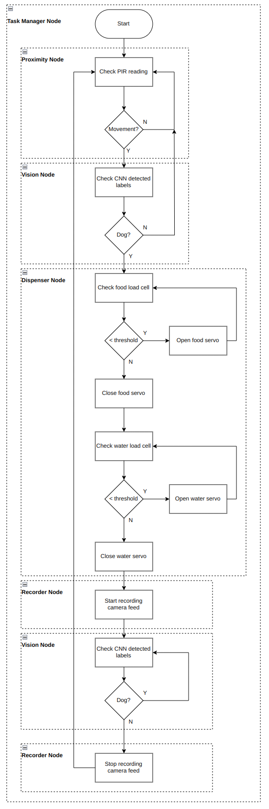

# Automatic Dog Feeder Control Software
Repo for the Automatic Dog Feeder using ROS2.

# Requirements
To be able to use this repository the below requirements have to be met.
1. It is highly recommended to use the docker files provided with vscode. All the docker files are provided in the *.devcontainer* folder of this repo. The instructions provided in [setting up docker with ros2](https://docs.ros.org/en/humble/How-To-Guides/Setup-ROS-2-with-VSCode-and-Docker-Container.html) should be followed with the provided *.devcontainer*. This might involve moving the *.devcontainer* provided in this repo to the location specified by the guide.

2. Clone [darknet_ros](https://github.com/leggedrobotics/darknet_ros) into the *ws* using the below commands. The *darknet* repo in *darknet_ros* are not the correct versions in the *foxy* branch, hence, it has to be manually changed. Additionally, the CUDA options in the *darknet_ros* CMakeLists might need to be set to OFF if no GPU is available.
```shell
# clone repo and checkout to current branch
cd ~/ws/src
git clone --recursive git@github.com:leggedrobotics/darknet_ros.git
cd darknet_ros
git checkout foxy

# update darknet repo to match darknet_ros
rm -rf darknet 
git clone https://github.com/pjreddie/darknet.git
cd darknet
git reset --hard 508381b
```
3. Setup [yasmin](https://github.com/uleroboticsgroup/yasmin) using the below commands:
```shell
# clone repos
cd ~/ws/src
git clone https://github.com/uleroboticsgroup/simple_node.git
git clone https://github.com/uleroboticsgroup/yasmin.git

# dependencies
cd yasmin
pip3 install -r requirements.txt

# tell colcon to ignore demo packages
cd yasmin_demo
touch COLCON_IGNORE
```

# Setup
Clone this repository into the *ws* that was created in the requirements step as follows:
```shell
cd ~/ws/src
git clone git@github.com:nilp-amin/adf.git
```
Then build the entire workspace. Note, some warnings may be generated, these can be safely ignored. First make sure that you are inside of the container as instructed by this [guide](https://docs.ros.org/en/humble/How-To-Guides/Setup-ROS-2-with-VSCode-and-Docker-Container.html).
```shell
. /opt/ros/iron/setup.bash
cd /home/ws
colcon build
. ./install/setup.bash
```
# Running
Assuming all the above steps have been completed, follow the below steps to run the entire system. It is assumed that everything is connected as per the pins stated in the various *params.yaml* files in each of the packages. These pin values can be updated as required, making sure they are the same type of pins as the default pins stated in this repo.
1. Open a terminal inside of the Docker container.
```shell
. /opt/ros/iron/setup.bash
cd /home/ws
. ./install/setup.bash
ros2 launch task_manager task_manager.launch.py
```

# Software Flow Diagram
The software flow diagram of this repo is provided below. The dotted boxes outline what parts of the flow diagram are associated with which ROS2 node. This flow diagram was implemented using a Finite State Machine (FSM), specifically; YASMIN.

<p align="center">
  
</p>

# Package Information
The software is split into a variety of ROS2 packages. Critical information about each of the packages is provided below.

## Task Manager
This package implements the FSM as provided in the flow diagram section. The [YASMIN](https://github.com/uleroboticsgroup/yasmin) library is used to implement the FSM. Essentially, this package contains a vareity of action clients which call the services provided by each of the below packages to:
1. Check if something is approaching the Automatic Dog Feeder (ADF).
2. If it is a dog.
3. Dispense food/water if required if it is a dog.
4. Record the camera feed. 

## Proximity
This package interfaces with a Passive Infra Red (PIR) sensor, and exposes a service to check if motion is detected by the sensor. This package contains a *params.yaml* file which has parameters which can be changed to modify how the package functions.

## Vision
This package interfaces with [darknet_ros](https://github.com/leggedrobotics/darknet_ros), and exposes a service to check if a dog is visible in the camera frame. It uses darknet_ros a ROS wrapper for YOLOv3 to reliably check if a dog is in the camera feed. By using the camera, movement detections of only a dog can be identified, removing the chance of random movements triggering later stages of the FSM. This package contains a *params.yaml* file which has parameters which can be changed to modify how the package functions.

## Recorder
This package interfaces with the camera feed, and exposes a service to start and stop the recording of the camera feed into rosbags. It was decided that rosbags be used as the method for storing the camera feed as they are versitile and can be easily converted to a suitable video format when required, whilst still being used as testing for future ROS projects. This package contains a *params.yaml* file which has parameters which can be changed to modify how the package functions.

## Dispense
This package interfaces with servos and load cells, and exposes a service to dispense food and water if the food and water bowls are empty. This package contains a *param.yaml* file which has parameters which can be changed to modify how the package functions.

## Interfaces
This package only contains custom interfaces so that the different packages can be communicated with. Currently it only contains custom *.srv* files.

# Assumptions
A variety of assumptions were made when designing this software which are provided below:
1. The sensors are wired up to the pins that are defined in the software.
2. The proximity sensor is positioned in a manner so that it can clearly detect motion close to the ADF.
3. The camera is positioned so it is looking down at the food and water bowls. So that it is able to record the dog eating the food and is able to detect if it is not there anymore. The camera position will also be such that the dog can be seen coming from a short distance away.
4. The mechanism for dispensing the food and water is not of concern. It should be designed such that when servo is at max angle, food/water is dispensed, and when it is at minimum angle no food/water is dispensed.
5. The force sensors are placed directly under the food/water bowls to detect their mass. The mass of a approx full water and food bowl is required beforehand.
6. No logic is implemented to stop the dog from continuously eating throughout the day. This would need to be added seperatly to stop the dog from getting obese.
7. There is always enough food and water in the ADF ready to be dispenesed.
8. The sensors have been tuned to work as required after testing using the software written.

# Considerations
A variety of considerations were made when designing this software which are provided below:
1. **The code has to be easibly customisible** - Every package has a *params.yaml* file to easily change configuration parameters, without having to look at the code itself.
2. **The code has to be expandable** - YASMIN framework was used to maximise the ability to easily add additional functionality to the ADF if required in the future.
3. **Food, water and recording of camera feed should only occur when a dog is activiely at the ADF** - Camera feed is used with darknet_ros and proximity sensor, to make sure only a dog triggers dispensing of food/water and starts recording of the camera feed.
4. **Food and water does not overflow** - load cells are used to check if the food and water bowls are not full.
5. **Overfeeding** - A schedule can be set to when to release food when the dog approaches the ADF. This can be easily added as a seperate state in the FSM.
6. **Cheap and robust** - The number of moving parts are kept to a minimum, and as few parts are used as possible.
7. **Error handeling** - Various stages of the software process are logged, which can be used in the event of malfunctions.
8. **Remote access** - By using a Raspberry Pi, a connection to WIFI can be created, allowing for remote access to the ADF.

# Required Hardware
A list of the required hardware is provided below. Some parts of the software have been written with a specific hardware in mind, and this has been noted appropriately.
1. Raspbery Pi (x1)
2. Raspberry Pi Cam (x1)
3. Servo (x2)
4. [ADC](https://www.adafruit.com/product/1083) (x2)
5. [Load cells](https://www.adafruit.com/product/1075) (x2)
6. PIR sensor (x1)

# Testing
A variety of testing needs to occur for this software. A variety of tests are detailed below.

## Unit Testing
Individual components of the software need to be tested. Each package in this repo needs to be tested individually to see if it performs as expected.
1. **Task Manager** - Use the introspection server provided by YASMIN to see how the ADF moves through different states during use.
2. **Proximity** - Test if the exposed service works when different motions in the environment are generated.
3. **Vision** - Test if the exposed service works when a variety of different objects are brought into the camera frame. Especially, a variety of dogs. A variety of lighting conditions also need to be tested.
4. **Recorder** - Test if the rosbags are being correctly generated using the exposed service. Playback the rosbags to see if the correct portion of the camera feed is being saved.
5. **Dispense** - Test if the exposed service is correctly checking the load cell readings, and dispensing food and water if required. Check threshold values for load cell are correct for when they sense a full food and water bowl.

## Integration Testing
The communication between software packages needs to be tested. A variety of scenarios which are likely to occur in the real life need to be created and see how the ADF software responds. Likely, the sensor angles, and thresholds will need to be changed to make sure they work as expected.

## Reliablity Testing
The reliablity and robustness of the software needs to be tested. A variety of fault injection scenarios should be created and see how the software responds.

## Performance Testing
The softwares performance under various conditions, such as different load levels, feeding frequencies, and environmental factors need to be tested. Performance tests need to measure response times, throughput, and resource usage to ensure the software can handle expected workloads efficiently.

